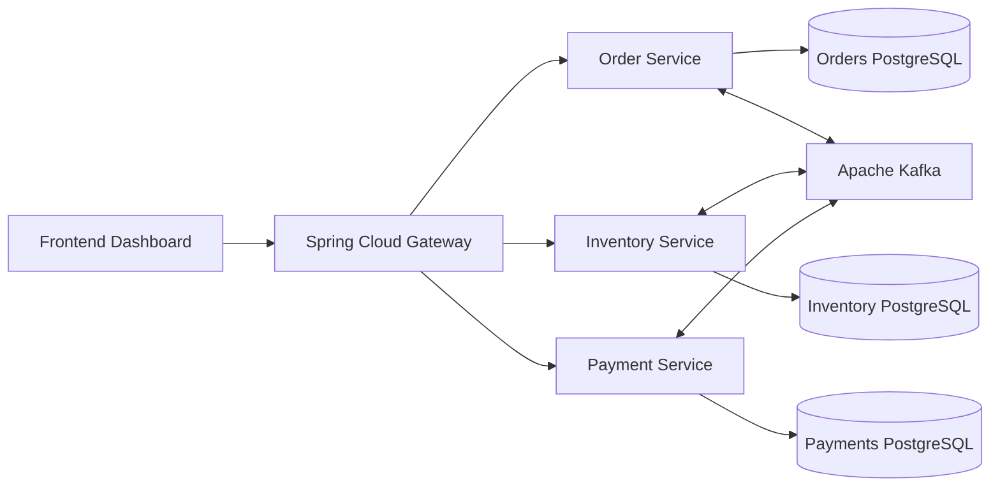
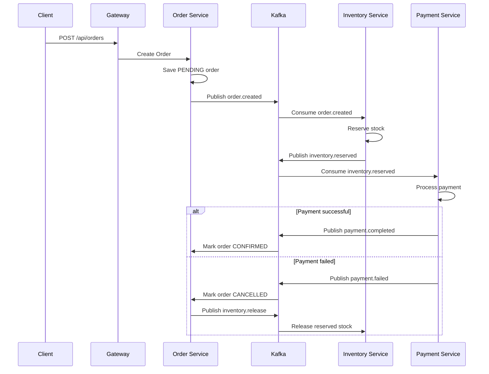

[Uploading README.md…]()
# Nexus: Distributed Microservices E-Commerce Platform

Nexus is a full-stack, event-driven e-commerce platform built with **Java 17**, **Spring Boot**, **Spring Cloud Gateway**, **PostgreSQL**, **Apache Kafka**, and a dark-themed frontend dashboard. The project demonstrates how modern commerce systems can split order, inventory, and payment logic into independent microservices while maintaining consistency through a choreography-based Saga Pattern.

## Project Goal

The goal of Nexus is to architect a scalable distributed backend where each service owns its business logic and database. Instead of using one monolithic application, the system separates responsibilities into focused services that communicate through Kafka events.

## Tech Stack

| Layer | Technology |
| --- | --- |
| Backend | Java 17, Spring Boot |
| API Gateway | Spring Cloud Gateway |
| Messaging | Apache Kafka |
| Database | PostgreSQL |
| Persistence | Spring Data JPA, Hibernate |
| Frontend | HTML, CSS, JavaScript |
| Infrastructure | Docker Compose |
| Architecture | Microservices, Event-Driven Architecture, Saga Pattern |

## Features

- Dark-themed frontend dashboard
- Order creation workflow
- Inventory reservation and release
- Payment processing simulation
- Kafka-based asynchronous communication
- Choreography-based Saga Pattern
- Automated rollback on payment failure
- Independent PostgreSQL database per service
- Gateway-based API routing
- Docker Compose infrastructure

## System Architecture



## Microservices

| Service | Port | Responsibility |
| --- | --- | --- |
| Gateway | `8080` | Routes all API requests |
| Order Service | `8081` | Creates orders and manages saga state |
| Inventory Service | `8082` | Reserves and releases product stock |
| Payment Service | `8083` | Processes payment success or failure |
| Kafka | `9092` | Event streaming backbone |
| Orders DB | `5432` | Stores order data |
| Inventory DB | `5433` | Stores inventory data |
| Payments DB | `5434` | Stores payment data |

## Saga Workflow



## Kafka Topics

| Topic | Producer | Consumer | Purpose |
| --- | --- | --- | --- |
| `order.created` | Order Service | Inventory Service | Starts inventory reservation |
| `inventory.reserved` | Inventory Service | Order Service, Payment Service | Moves saga to payment stage |
| `inventory.rejected` | Inventory Service | Order Service | Cancels order when stock is unavailable |
| `payment.completed` | Payment Service | Order Service | Confirms order |
| `payment.failed` | Payment Service | Order Service | Starts rollback flow |
| `inventory.release` | Order Service | Inventory Service | Releases reserved stock |

## Project Structure

```text
nexus-commerce/
├── common/
│   └── Shared DTOs, Kafka events, and topic contracts
├── gateway/
│   └── Spring Cloud Gateway and static dark landing page
├── order-service/
│   └── Order creation and saga state management
├── inventory-service/
│   └── Stock reservation and rollback handling
├── payment-service/
│   └── Payment authorization and failure simulation
├── frontend/
│   └── Dark-themed dashboard for order operations
├── docs/
│   └── Architecture notes
├── docker-compose.yml
└── pom.xml
```

## Running Locally

### Prerequisites

- Java 17
- Maven 3.9+
- Docker Desktop

### Start Infrastructure

```bash
docker compose up -d
```

### Build the Project

```bash
mvn clean package
```

### Run Services

Open separate terminals:

```bash
mvn -pl order-service spring-boot:run
```

```bash
mvn -pl inventory-service spring-boot:run
```

```bash
mvn -pl payment-service spring-boot:run
```

```bash
mvn -pl gateway spring-boot:run
```

### Open the Frontend

Open this file in your browser:

```text
frontend/index.html
```

The frontend calls the Gateway API at:

```text
http://localhost:8080/api
```

## API Examples

### Create a Successful Order

```bash
curl -X POST http://localhost:8080/api/orders \
  -H "Content-Type: application/json" \
  -d '{
    "customerId": "cust-1001",
    "sku": "NX-LAPTOP-17",
    "quantity": 1,
    "amount": 1299.00
  }'
```

### Trigger a Rollback

Payments above `5000.00` intentionally fail to demonstrate rollback behavior.

```bash
curl -X POST http://localhost:8080/api/orders \
  -H "Content-Type: application/json" \
  -d '{
    "customerId": "cust-1002",
    "sku": "NX-LAPTOP-17",
    "quantity": 1,
    "amount": 7500.00
  }'
```

### View System State

```bash
curl http://localhost:8080/api/orders
curl http://localhost:8080/api/inventory
curl http://localhost:8080/api/payments
```

## Frontend Dashboard

The dark-themed dashboard provides:

- Order creation form
- Rollback demo button
- Order status table
- Inventory table
- Payment table
- Summary cards for total orders, confirmed orders, reserved stock, and payments

## Key Engineering Concepts Applied

- Microservices decomposition
- Event-driven communication
- Database-per-service design
- Kafka choreography
- Saga Pattern rollback handling
- API Gateway routing
- Distributed consistency
- Frontend-backend integration

## Business Impact

Nexus demonstrates how an e-commerce backend can improve scalability and resilience by decoupling domain services. Kafka enables asynchronous communication, while the Saga Pattern ensures failed payment or inventory scenarios can be rolled back without using distributed database transactions.

## Future Enhancements

- Add JWT authentication
- Add service discovery with Eureka or Consul
- Implement Kafka outbox pattern
- Add dead-letter topics
- Add idempotency keys for event consumers
- Add OpenTelemetry distributed tracing
- Deploy using Kubernetes
- Upgrade frontend to React or Angular

## Summary

Nexus is a high-tech full-stack microservices project that models a real-world distributed commerce backend. It combines Java, Spring Boot, Kafka, PostgreSQL, Spring Cloud Gateway, Docker, and a dark frontend dashboard to demonstrate scalable, event-driven order processing with automated rollback handling.
