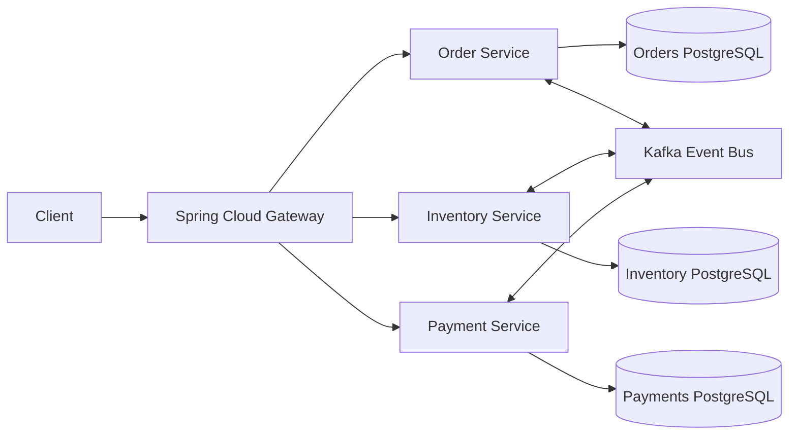

# Nexus Architecture

## Topic Contract

| Topic | Producer | Consumer | Purpose |
| --- | --- | --- | --- |
| `order.created` | Order | Inventory | Start stock reservation |
| `inventory.reserved` | Inventory | Order, Payment | Advance saga to payment |
| `inventory.rejected` | Inventory | Order | Cancel order |
| `payment.completed` | Payment | Order | Confirm order |
| `payment.failed` | Payment | Order | Cancel order and request rollback |
| `inventory.release` | Order | Inventory | Release reserved stock |

## Consistency Strategy

Each service commits its local database transaction before publishing the next event in the saga. Downstream services react to immutable Kafka messages and emit compensating events when their local step cannot complete.

For production hardening, add an outbox table per service, idempotency keys for event handlers, and dead-letter topics for poisoned messages. The current implementation keeps the project readable while showing the full choreography and rollback path.
